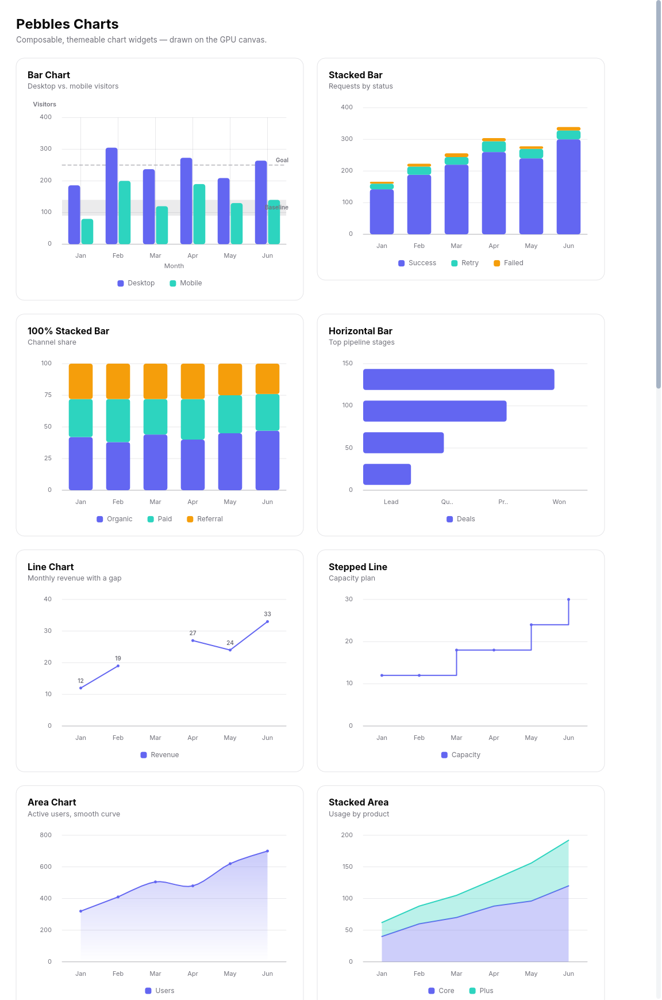

# pebbles-charts

Composable, themeable **chart widgets** for the
[Pebbles](https://github.com/pebbles-hq/pebbles) GUI framework — cartesian, radial, dense,
flow, and compact charts drawn on the GPU canvas, with a config-driven palette, a real
value axis, cursor-following tooltips, an interactive legend, keyboard navigation, and
light/dark theming for free.



Add it to your Pebbles app:

```toml
[dependencies]
pebbles = { git = "https://github.com/pebbles-hq/pebbles" }
pebbles-charts = { git = "https://github.com/pebbles-hq/pebbles-charts" }
```

The quickest chart — a grouped bar with two series:

```rust
use pebbles::prelude::*;
use pebbles_charts::{bar_chart, series};

fn view() -> impl IntoWidget {
    bar_chart(
        vec!["Jan".into(), "Feb".into(), "Mar".into()],
        vec![
            series("Desktop", vec![186.0, 305.0, 237.0]),
            series("Mobile", vec![80.0, 200.0, 120.0]),
        ],
    )
    .width(520.0)
    .height(260.0)
}
```

A fuller example — axis titles, a formatted currency axis, a reference line, a
right-side legend with per-series totals, and a click callback:

```rust
use pebbles::prelude::*;
use pebbles_charts::{bar_chart, reference_line, series, LegendPosition};

fn revenue_chart() -> impl IntoWidget {
    bar_chart(
        vec!["Q1".into(), "Q2".into(), "Q3".into(), "Q4".into()],
        vec![
            series("Product", vec![42_000.0, 55_000.0, 61_000.0, 78_000.0]),
            series("Services", vec![18_000.0, 24_000.0, 27_000.0, 33_000.0]),
        ],
    )
    .y_axis_title("Revenue")
    .value_formatter(|v| format!("${:.0}k", v / 1_000.0)) // axis + tooltip
    .reference_line(reference_line(60_000.0).label("Target"))
    .legend_position(LegendPosition::Right)
    .legend_values(true)                 // "Product $236k" beside each swatch
    .on_point(|category, series, value| {
        println!("clicked category {category}, series {series} = {value}");
    })
    .width(560.0)
    .height(300.0)
}
```

Pie / donut with slice labels, per-slice percentages in the legend, and a click
callback — hover pops the slice out and shows its value:

```rust
use pebbles::prelude::*;
use pebbles_charts::{pie_chart, slice};

fn browser_share() -> impl IntoWidget {
    pie_chart(vec![
        slice("Chrome", 62.0),
        slice("Safari", 18.0),
        slice("Firefox", 9.0),
        slice("Edge", 7.0),
        slice("Other", 4.0),
    ])
    .data_labels(true)     // percentage inside each slice
    .legend_values(true)   // "Chrome 62%" in the legend
    .on_slice(|index, value| println!("slice {index} = {value}"))
    .size(260.0)
}
```

## Charts

| Constructor | Chart |
|---|---|
| `bar_chart(categories, series)` | grouped bars |
| `stacked_bar_chart(categories, series)` | stacked bars |
| `percent_stacked_bar_chart(categories, series)` | 100% stacked bars |
| `horizontal_bar_chart(categories, series)` | horizontal bars |
| `line_chart(categories, series)` | line(s) with points |
| `stepped_line_chart(categories, series)` | stepped line(s) |
| `area_chart(categories, series)` | filled line(s) |
| `stacked_area_chart(categories, series)` | stacked filled areas |
| `percent_stacked_area_chart(categories, series)` | 100% stacked filled areas |
| `combo_chart(categories, combo_series)` | mixed bar / line / area series |
| `scatter_chart(point_series)` | numeric x/y scatter |
| `bubble_chart(point_series)` | scatter with per-point radius |
| `radar_chart(categories, series)` | radial category radar |
| `progress_ring(label, value, max)` | circular progress ring |
| `gauge_chart(label, value, max)` | gauge arc |
| `candlestick_chart(categories, candles)` | financial candles |
| `ohlc_chart(categories, candles)` | OHLC ticks |
| `heatmap_chart(x_categories, y_categories, cells)` | dense heat grid |
| `funnel_chart(slices)` | funnel stages |
| `sankey_chart(links)` | simple flow links |
| `sparkline(values)` | compact chrome-less line |
| `pie_chart(slices)` | pie |
| `donut_chart(slices)` | pie with a hole (`.hole(frac)` to tune) |

- **Cartesian** charts take `Vec<String>` categories + `Vec<Series>`
  (`series("Label", vec![..])`), and support `.width` `.height` `.legend(bool)`
  `.legend_position(LegendPosition::Bottom | Top | Left | Right)` `.legend_values(bool)`
  `.grid(bool)` `.y_axis(bool)` `.y_range(min, max)` `.tick_count(n)` and
  `.value_formatter(|value| ...)` `.tooltip(bool)` `.on_point(...)`
  `.curve(CurveInterpolation::Linear | Step | Smooth)` `.category_window(start, end)`
  `.zoom_categories(start, end)` `.pan_category_window(offset)` `.sort_by_total_desc()`
  `.sort_by_total_asc()` `.top_n(n)` and `.aggregate_every(bucket_size)`.
- **Axes and labels** support `.x_axis_title(..)` `.y_axis_title(..)`
  `.right_y_axis(min, max)` `.right_y_axis_title(..)` `.right_value_formatter(..)`
  `.vertical_grid(bool)` `.category_label_mode(CategoryLabelMode::Auto | All | Skip(n) |
  Truncate(n) | Hidden)` `.reference_line(reference_line(value).label(..))`
  `.reference_band(reference_band(start, end).label(..))` and `.data_labels(bool)`.
- **Missing values** are supported with `series_with_gaps("Label", vec![Some(1.0), None,
  Some(3.0)])`; line and area charts break the path at gaps, while bars/tooltips omit
  the missing mark.
- **Combo** charts take `Vec<ComboSeries>` from
  `combo_series("Label", values, SeriesKind::Bar | Line | Area)`.
- **Scatter / bubble** charts take `Vec<PointSeries>` built from `point` or
  `bubble_point`; their x-axis is numeric rather than categorical and supports `.x_range`
  `.y_range` `.x_scale(AxisScale::Linear | Log10 | Time)` `.x_log()` `.x_time()` and
  `.tick_count(n)`.
- **Pie / donut** take `Vec<Slice>` (`slice("Label", value)`), and support `.size`
  `.hole` `.legend` `.legend_position(..)` `.legend_values(bool)` `.data_labels(bool)`
  `.tooltip(bool)` and `.on_slice(|index, value| ...)`.
- **Specialized** charts have focused constructors for their data shape:
  `candle`, `heat_cell`, and `sankey_link` provide typed inputs.

Cartesian charts compute a nice y-domain, include zero unless an exact `.y_range` is set,
render y-axis value labels, and draw positive and negative values from the correct zero
baseline.

## Interaction

- **Cursor-following tooltips** — hovering a cartesian chart or a pie/donut shows a value
  tooltip that tracks the pointer, with a crosshair / active-category band (cartesian) or
  a popped-out slice (radial). Also fires on tap and drag for touch. Toggle with
  `.tooltip(bool)`.
- **Click events** — `.on_point(category, series, value)` on cartesian charts and
  `.on_slice(index, value)` on pie/donut.
- **Interactive legend** — every legend is clickable: tap a chip to hide/show that series
  or slice. The plot rescales, grouped bars reflow, and pie slices re-proportion; the chip
  dims while hidden.
- **Keyboard** — a chart is focusable (Tab or click); the **←/→** arrows move the active
  category, highlighting it and drawing the crosshair.

## Animation

Charts animate their marks in on mount — cartesian marks **wipe in left-to-right** (grid,
axes and reference lines stay put) and pie/donut wedges **sweep in radially**. When the
**data changes** on a re-render, the marks **tween** from the old values to the new ones
(cartesian bars/lines/area and the y-axis morph together; pie/donut wedges re-proportion)
rather than snapping — hovering, tooltips, and data labels always report the real target
values. Adding or removing a series/slice re-runs the reveal as an enter animation.
Animations **auto-honor the OS reduced-motion setting** — when the user has asked to
minimize motion (`prefers-reduced-motion` on web, the desktop equivalent otherwise),
charts render statically by default. Force it either way with `.animate(true|false)`, and
tune the duration with `.animation_ms(n)` (default 600, pie 700).

## Accessibility

Every chart emits an accessibility node so a screen reader announces it instead of hitting
an opaque canvas: a **role** (image/figure), a spoken **summary** (chart type + shape, or
your `.a11y_label("…")`), and — as the node's value — a full **data read-out** of every
point (`"Desktop: Jan 10, Feb 20, Mar 30; Mobile: …"`) or slice (`"Chrome 62 (62%), …"`).
That's the data-table fallback, fed to the platform assistive tech through Pebbles'
semantics tree. Charts are also keyboard-focusable with ←/→ category traversal.

## Theming

- **Chrome** (grid lines, axis labels) follows the app's `theme()`, so charts match
  light/dark automatically.
- **Series colors** come from a built-in [`palette`] (6 distinct hues, cycled), or set
  one explicitly: `series("Desktop", vals).color(Color::from_rgba8(0x63,0x66,0xF1,0xFF))`
  / `slice("Chrome", 62.0).color(..)`.
- **Whole-palette override** — swap the categorical ramp for a chart with
  `.palette(vec![..])` (cartesian + pie/donut). Pass `cvd_palette().to_vec()` for a
  built-in **colorblind-safe** ramp (Okabe–Ito), or any custom `Vec<Color>`; per-series /
  per-slice `.color(..)` still wins.
- **Empty state** — a chart handed no data (empty series/slices, or only missing/zero
  values) renders a calm centered "No data" panel at its footprint instead of a blank or
  broken plot — the state a live dashboard hits before its first payload lands.
- **Legend** is generated from series/slice labels; hide with `.legend(false)`, move it
  with `.legend_position(..)`, show per-entry totals/percentages with `.legend_values(true)`,
  and it's interactive by default (click to toggle a series/slice).
- **Gradient area fills** — `.area_gradient(true)` fills area / stacked-area series with a
  vertical gradient (series color fading to transparent at the baseline) instead of a flat
  translucent fill.
- **Reference lines** are drawn **dashed** (the conventional annotation style), distinct
  from the solid data marks.

## Run the sample

```sh
cargo run -p demo
# headless screenshot (no display needed):
SHOT=1180:1600:/tmp/charts.rgba cargo run -p demo
```

## Roadmap

- Responsive fill-parent sizing.
- A per-slot `ChartStyle` (fonts, strokes, tick counts) beyond the palette.
- Per-series fade-out on removal.

## License

Licensed under the [Apache License, Version 2.0](LICENSE).

## Author

Reyco Seguma
